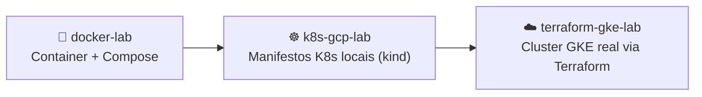
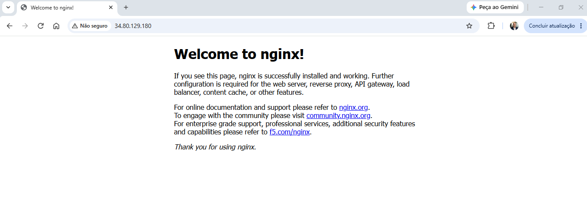
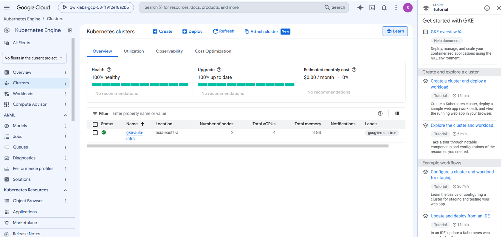
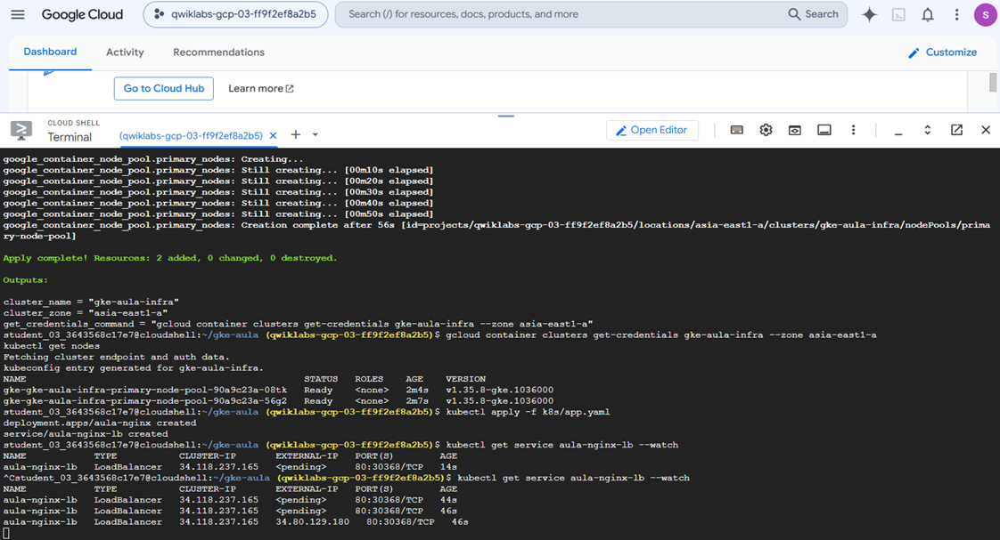

# 🐳 Docker & Kubernetes Lab — dos containers ao GKE

Repositório com os laboratórios práticos que fiz na disciplina de **Cloud Computing** da Pós em AI Engineering (Impacta), cobrindo containerização, orquestração local e Kubernetes gerenciado na nuvem. A ideia é mostrar a evolução: primeiro container isolado, depois orquestração multi-serviço, depois Kubernetes local, e por fim o mesmo tipo de manifesto rodando num cluster gerenciado de verdade (GKE), provisionado via Terraform.

---

## 🧭 Evolução do laboratório

| Etapa | Pasta | O que resolve | Status |
|---|---|---|---|
| 1 | [`docker-lab/`](./docker-lab) | Build de imagem própria + orquestração via `docker-compose` | ✅ |
| 2 | [`k8s-gcp-lab/`](./k8s-gcp-lab) | `Pod`, `Deployment` e `Service` — testados localmente em `kind` | ✅ |
| 3 | [`terraform-gke-lab/`](./terraform-gke-lab) | Mesmos manifestos, cluster **GKE** real provisionado via Terraform | ✅ |

---

## 📦 `docker-lab/`

Uma imagem Docker customizada (`dockerfile` + `index.html`) orquestrada com `docker-compose.yaml`. Primeiro contato com containerização: build de imagem própria e subida de serviço via compose.

## ☸️ `k8s-gcp-lab/`

Manifestos Kubernetes puros — `pod.yaml`, `deployment.yaml` e `service.yaml` — testados localmente num cluster `kind` (via Docker Desktop). É aqui que fica visível a diferença entre subir um `Pod` avulso e um `Deployment` com réplicas e `Service` do tipo `LoadBalancer` na frente. Localmente, esse `LoadBalancer` nunca sai do estado `<pending>`, porque não existe um balanceador de carga de verdade rodando na minha máquina — o que me levou ao próximo passo.

## ☁️ `terraform-gke-lab/` ✅

O "final feliz" da história acima: os mesmos manifestos de `k8s-gcp-lab`, agora aplicados num cluster **GKE (Google Kubernetes Engine)** real, provisionado via Terraform (rede e service account padrão do projeto — a conta temporária do lab não tem permissão de IAM pra criar VPC/subnet/service account dedicadas —, cluster zonal e node pool). Dessa vez o `LoadBalancer` realmente saiu do `<pending>` e ganhou um `EXTERNAL-IP` público de verdade, com o nginx respondendo no navegador. Esse projeto tem seu próprio README com o passo a passo completo — os obstáculos reais, os prints e como rodei tudo isso via Google Cloud Skills Boost (sem precisar de cartão de crédito pessoal) — detalhes em [`terraform-gke-lab/README.md`](./terraform-gke-lab/README.md).

---

## ✅ Resultado final

`EXTERNAL-IP` público de verdade, saindo do `<pending>` — exatamente o problema que o `kind` local nunca resolvia:

<table>
<tr>
<td width="33%">

**LoadBalancer com `EXTERNAL-IP` público:**

</td>
<td width="33%">

**Cluster GKE saudável no Console:**

</td>
<td width="33%">

**`terraform apply` + `kubectl` no Cloud Shell:**

</td>
</tr>
</table>

---

## 🛠️ Stack

`Docker` · `Docker Compose` · `Kubernetes (kind)` · `Terraform` · `Google Kubernetes Engine (GKE)` · `Google Cloud Skills Boost`

## 🧩 Contexto

Este repositório também faz parte de um portfólio maior de Infraestrutura como Código, ao lado de laboratórios equivalentes em AWS e Azure — a ideia é ter a mesma disciplina de provisionamento (Terraform, destruição dos recursos ao final, documentação do processo) replicada nas três nuvens.

## 👤 Autor

**Heuler Silva** — Pós-graduando em AI Engineering (Impacta), em transição de carreira para Engenharia de Dados & IA.
